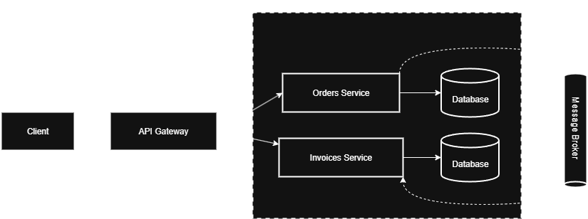

# Rockseat Microservice Challenge

Sistema em Microsserviços desenvolvido durante o Desafio Microsserviços Escaláveis da Rockseat

## 🧩 Overview

- Arquitetura: Microsserviços (Microservices)
- Comunicação: Assíncrona com mensageria (RabbitMQ)
- Microsserviços: Orders, Invoices
- Tecnologias: Node.js, TypeScript, RabbitMQ, PostgreSQL, OpenTelementry, Pulumi, Docker

## 📦 Estrutura da Documentação

Este repositório está dividido em seções para facilitar o acesso ao conteúdo de acordo com o escopo desejado:

- **[Invoices](invoices/README.md)** – Documentação dos endpoints, autenticação, exemplos de requisição e resposta, códigos de erro e mais.
- **[Orders](orders/README.md)** – Documentação dos endpoints, autenticação, exemplos de requisição e resposta, códigos de erro e mais.

## System Design



## 🛠️ Tecnologias Utilizadas

Este projeto utiliza as seguintes tecnologias e ferramentas:

- [Node.js](https://nodejs.org/)
- [TypeScript](https://www.typescriptlang.org/)
- [RabbitMQ](https://www.rabbitmq.com/)
- [Pulumi](https://www.pulumi.com/)
- [Drizzle ORM](https://orm.drizzle.team/)
- [Fastify](https://fastify.dev/)
- [Zod](https://zod.dev/)
- [Docker](https://www.docker.com/)
- [Docker Compose](https://docs.docker.com/compose/)
- [Kong Gateway](https://developer.konghq.com/gateway/)
- [Jaeger](https://www.jaegertracing.io/)
- [Yarn](https://yarnpkg.com/)
- [Postgress](https://www.postgresql.org/)
- [Amqplib](https://www.npmjs.com/package/amqplib)
- [Pino](https://github.com/pinojs/pino)
- [OpenTelemtry](https://opentelemetry.io/)

## 📦 Microsserviços

| Serviço          | Porta | Descrição                                                              |
|------------------|-------|------------------------------------------------------------------------|
| Orders Service   | 3333  | Criação e gerenciamento de pedidos                                     |
| Invoices Service | 3334  | Geração e gerenciamento de faturas associadas aos pedidos realizados   |


## 🚀 Como executar localmente

### 1️⃣ Pré-requisitos

Certifique-se de ter instalado:

- [Node.js](https://nodejs.org/)
- [Yarn](https://yarnpkg.com/)
- [Docker](https://www.docker.com/)
- [Docker Compose](https://docs.docker.com/compose/)

### 2️⃣ Clonando o repositório

```sh
git clone https://github.com/daniel-fonte/rockseat-microservice-challenge.git
cd rockseat-microservice-challenge
```

### 3️⃣ Iniciando Services

É necessário subir o RabbitMQ e o Kong Gateway antes das services, para isso basta executar apenas:

```sh
docker compose up -d
```

### 4️⃣ Iniciando Orders Microsservice
---
#### 1️⃣ Acessando serviço de Orders

```sh
cd orders
```

#### 2️⃣ Instalando as dependências

```sh
yarn
```

#### 3️⃣ Configurando as variáveis de ambiente

Crie um arquivo `.env` na raiz do diretório `orders/` do projeto e configure as variáveis necessárias. Exemplo:

```env
NODE_ENV=
LOG_LEVEL=

HOST=
PORT=

DATABASE_URL=

BROKER_URL=

OTEL_TRACES_EXPORTER=
OTEL_EXPORTER_OTLP_ENDPOINT=
OTEL_SERVICE_NAME="orders"
OTEL_NODE_ENABLED_INSTRUMENTATIONS=
```

#### 4️⃣ Iniciando banco de dados

```sh
docker compose up database -d
```

#### 5️⃣ Executando migrations

```sh
yarn drizzle-kit migrate
```

#### 6️⃣ Iniciando servidor HTTP

```sh
yarn dev
```

### 5️⃣ Iniciando Invoices Microsservice
---
#### 1️⃣ Acessando serviço de Invoices

```sh
cd invoices
```

#### 2️⃣ Instalando as dependências

```sh
yarn
```

#### 3️⃣ Configurando as variáveis de ambiente

Crie um arquivo `.env` na raiz do diretório `invoices/` do projeto e configure as variáveis necessárias. Exemplo:

```env
NODE_ENV=
LOG_LEVEL=

HOST=
PORT=

DATABASE_URL=

BROKER_URL=

OTEL_TRACES_EXPORTER=
OTEL_EXPORTER_OTLP_ENDPOINT=
OTEL_SERVICE_NAME="orders"
OTEL_NODE_ENABLED_INSTRUMENTATIONS=
```

#### 4️⃣ Iniciando banco de dados

```sh
docker compose up database -d
```

#### 5️⃣ Executando migrations

```sh
yarn drizzle-kit migrate
```

#### 6️⃣ Inciando servidor HTTP

```sh
yarn dev
```

#### 6️⃣ Iniciando worker

```sh
yarn worker:order
```
